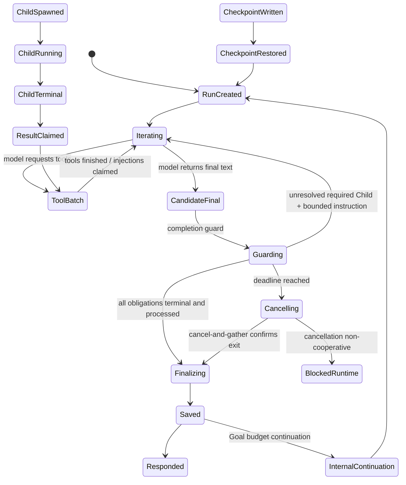

# 子 Agent 生命周期与 Tool 恢复链路实施方案

状态：实施前评审稿

基线：`origin/main`（当前 fork），本稿依据工作区当前代码、现有修复计划、测试和 V4 评测证据编写。文中写“建议”或“待确认”的内容不是已批准 API。

## 1. 执行摘要

### 1.1 目标

本项目有两个相互独立、在同一 Audit Trace 中交汇的交付目标：

1. 收口 `required=true` Child 的生命周期，使主 Run 在必需 Child 未进入真实终态前不能发布代表“已完成”的最终答复，同时保留 `required=false` 的后台语义。
2. 将运行时已经记录的 `recovery_of_tool_call_ids` 投影为安全、可定位、可聚焦的 `tool_recovery` Graph 边，且不把事后恢复关系伪装成 `caused_by_event_id`。

### 1.2 非目标

- 不把 `required` 全部改造成 Tool 调用内同步等待。
- 不重写历史权威 Audit JSONL、Payload、catalog 或评测资产。
- 不按 basename、同名 Tool、时间相邻、前端字符串或资源摘要猜测恢复关系。
- 不新增虚假的 LLM 决策 Event，不把 Tool 恢复放入严格因果链。
- 不在本阶段同时引入未经确认的 `completion_policy`、跨 Trace 恢复或新的公开 Payload 字段。

### 1.3 最高风险

最高风险是 completion guard 与现有 `AgentLoop` pending queue、Goal continuation、Session lock 和 streaming 同时工作时形成死锁、无界等待或不可撤回的“完成”输出。缓解原则是：单一可观测 deadline、等待期间不持有 `GoalOrchestrationStore` session lock、取消后必须 `gather` 确认退出、最终回答在 guard 前缓冲或关闭 final streaming，并保留 Loop 防御性 invariant。

### 1.4 建议交付顺序

先冻结契约和合成 fixture，再实现提示/屏障，再实现 Run completion guard 和 durable claim，之后实现后端 Graph/API 兼容，最后实现 WebUI 关系检查器和真实 Chromium 验收。任何 UI 工作不得先于数据语义和后端边契约。

## 2. 现状证据

### 2.1 源码已证实

| 事实 | 证据 |
|---|---|
| `spawn` 是后台启动 | `SpawnTool.execute()` 调用 `SubagentManager.spawn()`；`SubagentManager.spawn()` 在 `_spawn_lock` 内登记后用 `asyncio.create_task()`，立即返回 `task_id`、`required`、`task_group`、`child_run_id`。 |
| required 义务已持久化但只保护 Goal | `GoalOrchestrationStore.register()/finish()/select()` 写入 Session metadata；`required_gate()` 只允许 `succeeded` 或被成功 replacement 解析；`UpdateGoalTool.execute(action="complete")` 在 `required_gate()` 失败时返回错误。 |
| await 是显式一次性 barrier | `AwaitSubagentsTool.execute()` 只能选 `task_ids` 或 `task_group`，调用 `select()`、`set_phase("waiting_for_children")`、`SubagentManager.wait_for()`，单次参数上限为 300 秒；超时返回 `waiting=true`，不取消 Child。 |
| 当前等待不是 join-all | `AgentLoop._run_agent_loop()` 的 `_drain_pending()` 在 pending queue 为空且 session 有运行 Child 时最多等第一条回流 300 秒；一条消息到达即可继续。 |
| 当前 Runner 没有完成硬门 | `AgentRunSpec` 有 `injection_callback`、`goal_active_predicate`、`goal_continue_message`，没有 `completion_guard`；`AgentRunner._run_core()` 在模型最终内容、错误收口和 max-iteration finalization 分支直接进入结果处理。 |
| streaming 可在最终判定前产生输出 | `_run_core()` 在 Tool 调用前调用 `hook.on_stream_end(..., resuming=True)`，并在普通响应路径使用 stream callback；没有 required Child completion gate。 |
| Child 结果走 MessageBus | `SubagentManager._announce_result()` 发布 `InboundMessage(metadata.injected_event="subagent_result", subagent_task_id=...)`；`AgentLoop._persist_subagent_followup()` 以 Session 历史扫描去重。 |
| 取消已有但没有不响应策略 | `cancel_by_session()`/`close()` 对 task 调用 `cancel()` 后 `asyncio.gather(..., return_exceptions=True)`；没有二次宽限、独立可杀执行器或 fail-closed 状态契约。 |
| Goal continuation 独立于 Child-result | `turn_continuation.maybe_continue_turn()` 在 max iterations 且 Goal 仍 active 时将内部 continuation 放入 pending queue；使用 `_internal_continuation_*` metadata，最多 12 轮。 |
| Checkpoint 可恢复 | `AgentLoop._set_runtime_checkpoint()` 写入 Session；`_restore_runtime_checkpoint()` 以 message key 做重叠去重，并为未完成 Tool 写入中断摘要。 |
| Hook 已记录显式恢复 ID | `RunnerAuditHook.after_execute_tool_terminal()` 维护 `_pending_resource_failures`；成功 Tool 仅按规范化 `resource_key`/`correction_keys` 计算 `recovery_of_tool_call_ids`，由 runtime 写入 `ToolFinishedDraft`。 |
| Graph 尚无恢复边 | `AuditEdgeType` 当前没有 `tool_recovery`；`AuditGraphBuilder._edges()` 和 `_trace_full_edges()` 只生成 sequence、spawn、result_return、caused_by、retry 等边。 |
| Graph 已有安全锚点和 collapse | `AuditGraphEdge.anchor` 已有 source/target Event ID；`_collapse_groups()` 保护的边类型当前没有 `tool_recovery`。 |
| API 已有 Graph/Events/Payload 边界 | `WebUIAuditRouter._graph()` 只序列化 Graph；`_events()` 提供分页；`_payload()` 独立认证并 `no-store`。Graph ETag 使用 `GRAPH_BUILDER_VERSION`，当前为 3。 |
| 前端恢复焦点当前不含 Tool 恢复 | `TraceFocusMode` 有 `resume`；`TraceGraph.relatedIds()` 的 resume 只允许 `result_return`、`resumed_from`；`TraceEdgeType` 同样没有 `tool_recovery`。 |
| 前端已有有界 Event 定位 | `useAuditTimeline.ensureEvent()` 最多追加 5 页、累计 1000 Event、10 秒；能返回 `found/not_found/limit/cursor_stale/error`。 |

### 2.2 已有测试证明

- `tests/agent/tools/test_goal_orchestration.py::test_three_required_children_finish_out_of_order_without_lost_updates` 证明乱序 finish 不丢状态；同文件参数化测试证明 `failed/cancelled/timed_out/lost` 阻止 Goal complete；replacement 测试证明旧证据保留且新任务可满足 gate。
- 同文件 `test_await_subagents_timeout_waits_once_and_keeps_goal_active` 证明 timeout 只等待一次、保留 active Goal；`test_goal_cancel_and_block_cancel_running_required_children` 证明当前 cancel 路径会取消并写终态。
- `tests/agent/tools/test_subagent_tools.py` 覆盖并发限制、配置的 max iterations、pending queue 有/无 Child 时的等待差异和 300 秒超时。
- `tests/agent/test_runner_injections.py` 覆盖 injection callback、final response 后的 resuming stream、fatal/LLM/empty/max-iteration 入口、injection cycle 上限和 pending queue 清理；这些测试证明现有 injection 机制，不证明 required completion guard。
- `tests/agent/test_subagent_lifecycle.py` 覆盖 close cancel/gather、终态 cache、stop reason 映射和运行计数；没有不响应取消的真实执行器测试。
- `tests/agent/test_runner_audit.py::test_read_file_corrections_emit_explicit_recovery_link` 证明第三个成功 ToolFinished 的 `recovery_of_tool_call_ids` 只包含首个失败调用 ID。
- `tests/audit/test_graph_builder.py::test_explicit_recovery_distinguishes_three_config_paths` 证明三路径恢复摘要不误连，但当前断言的是节点摘要，不是 `tool_recovery` 边。
- `tests/audit/test_webui_api.py` 覆盖 Graph ETag、payload-free Graph、trace_full additive graph 和分页；没有新边类型或边点击断言。
- `webui/src/tests/trace-graph.test.tsx` 覆盖关系命中数/零命中、图例、节点选择；`audit-trace-ux.test.tsx` 覆盖 Payload 显式加载、Event 定位去重和 5 页上限；没有 Tool recovery edge fixture。

### 2.3 用户/评测已复现

当前分支的 V4 真实 Chromium 运行记录（合成 fixture）显示：三条 `read_file` call ID 不同，第三个成功调用只恢复首个失败调用；`unrelated` 同 basename 被排除；Graph/UI 的现有 `恢复链路` 能显示 2 个节点/1 条边，但实际边类型只有 `result_return`，Graph edge 统计为 `sequence=28、spawn_branch=1、result_return=1`。这证明现有安全展示和跨 Run 回流基础，不证明 `tool_recovery` 已实现。

V4 还证明了 5 页/1000 Event/10 秒上限、双端 Event 定位、Payload 显式加载和 Chromium desktop/mobile 基础回归。该运行记录没有覆盖 required=true 主 Run completion guard。

### 2.4 尚待浏览器复现

以下必须在实施后用固定合成 fixture 和真实 Chromium 重新验证：

- required Child 乱序完成时，主 Run 在最后一个 Child 真实终态前没有 final outbound；
- completion guard 拒绝后没有发送不可撤回的最终 stream token；
- `tool_recovery` 边的命中数、空状态、边点击关系检查器及失败/恢复双端 Event 定位；
- collapse、筛选、分页上限、cursor stale、Payload 不自动加载在桌面 1440x900 和移动 390x844 下无重叠和无 console/page error。

## 3. 运行时语义

### 3.1 参与者

- **Run**：一次 `AgentRunner.run(AgentRunSpec)`，由主 Run、Child Run 或 continuation Run 承载。
- **Iteration**：`AgentRunner._run_core()` 的一次模型请求/Tool 批处理循环。
- **MessageBus**：`SubagentManager._announce_result()` 发布结果，`AgentLoop._pending_queues` 在活动 Run 中接收或在 dispatch 时路由。
- **AgentLoop**：`_process_message()` 驱动 Restore -> Compact -> Build -> Run -> Save -> Respond；还负责 session lock、checkpoint 和 continuation。
- **AgentRunner**：只编排模型、Tool、injection、stream、checkpoint 和最终结果，不直接依赖 Goal store。
- **Child Run**：`AuditRunContext.child_run(source_type="subagent")` 创建，带 `parent_run_id`、`child_run_id` 和 `spawn_tool_call_id`。
- **Goal**：Session metadata 中的 active/completed/blocked/cancelled 目标，义务在 `orchestration.tasks` 中持久化。
- **Continuation**：Goal internal continuation、Checkpoint 恢复、Child-result continuation 是三个不同概念，必须分别记录 owner、deadline 和用户可见性。

### 3.2 当前与目标状态转移



目标语义约束：`required=true` Child 从 `ChildSpawned` 到 `ChildTerminal` 前，主 Run 只能继续内部 Iteration 或进入明确取消/阻塞路径，不能进入代表完成的 `Responded`；`required=false` 不受这条硬门影响。

### 3.3 owner/deadline/可见性矩阵

| 场景 | obligation owner | deadline | 用户可见性 |
|---|---|---|---|
| 主 Run 创建 required Child | `owner_run_id=主 Run` | 由阶段 0 冻结的 Run join deadline | Child 未终止时不发完成型 final |
| Goal internal continuation | 创建新 Run 时原子转移 `active_owner_run_id`，保留旧 owner | 默认建议继承剩余预算，待确认 | 旧切片 suppress，新切片继续收口 |
| Checkpoint 恢复 | 从 durable orchestration 恢复并显式接管 | 不得用墙上时间猜剩余预算，待确认重建规则 | 未解决 required obligation 时不发完成型 final |
| Child-result continuation | required Child 正常路径禁止触发；仅后台策略允许 | 使用后台策略预算 | `background_notify` 或 `background_silent`，待确认 |
| replacement Child | 新 Child 归属创建 replacement 的当前 Run，保留 `resolved_by_task_id` | 原 obligation 的剩余预算或新预算，待确认 | replacement 未终止时不发完成型 final |

## 4. Child 生命周期方案

### 4.1 提示词职责

修改 `SpawnTool.description`、`required` schema 描述、`AwaitSubagentsTool.description`、`goal_runtime.md` 和 Goal continuation prompt，使模型看到以下有界信息：required task ID、label、group、status、replacement 关系、剩余等待预算和推荐的 `await_subagents(task_group=...)`。

提示必须要求：创建 `required=true` 后，在最终答复或 `update_goal(action="complete")` 前按完整 group/IDs 调用 `await_subagents`；失败/超时不得声称完成，只能继续等待、显式 replacement、`block` 或按运行时终态诚实报告。Child 原始任务正文、完整参数和异常堆栈不得注入动态提示。

提示只提高正确率。它不能替代 runtime guard，也不能伪造 LLM Tool Call。

### 4.2 `await_subagents` 触发条件

保留当前显式 Tool 作为中途同步点：

- 参数继续互斥：`task_ids` 或 `task_group`；保留最多 100 个 ID、单次 0-300 秒上限。
- 选择范围必须受当前 Goal/session 所有权约束。
- 返回 `barrier_satisfied`、`waiting` 和每个任务的 bounded status/error 摘要。
- `waiting=true` 只表示 barrier 尚未满足，不能把它映射为终态，也不能因此允许 final。
- runtime auto-barrier 若实施，必须记录 `source=runtime_guard` metadata，不生成一次假的 `await_subagents` Tool Event。

### 4.3 completion guard 入口

建议在 `AgentRunSpec` 增加一个结构化、可选的异步 callback，例如 `completion_guard`；名称、返回类型和 feature flag 必须在阶段 0 确认。候选返回值应包含 `allow`、有界 `unresolved`、`injected_messages`、`deadline_reached`、`owner_run_id` 和 `claim_ids`，但在批准前不得把该候选类型当成公开契约。

`AgentRunner._run_core()` 在以下所有接受 `final_content` 的出口调用 guard：

- 正常模型 final；
- Tool error/fatal 后收口；
- max iterations 的 no-tools finalization/fallback；
- empty final 和 length recovery fallback；
- Goal internal continuation 切片前；
- stop/shutdown/provider error/stream abort 的完成型出口判定。

guard 拒绝时不得持久化当前候选 assistant final，不得发送完成型 outbound；应注入有界 runtime 指令、claim 可消费的 Child 结果，并回到下一 Iteration。`AgentLoop._state_respond()` 增加只读 invariant 作为最后防线，但不在保存后盲目重启同一 Runner。

### 4.4 deadline、取消与不可协作任务

阶段 0 必须冻结：deadline 单调时钟起点、同一主 Run 后续 Iteration 是否继承、Continuation/Checkpoint/重启如何恢复、deadline 后的 `cancelled`/`timed_out` 映射。

建议执行顺序：读取 owner Run 的未终止 required Child -> 释放 Goal store lock -> `cancel-and-gather` -> 短取消宽限 -> 检查每个 asyncio Task 已退出 -> 分段写 durable 终态 -> 再允许 LLM 处理失败/替代/block。

当前 asyncio Task 不能同时保证“有界返回”和“不可协作 I/O 必然终止”。阶段 0 必须二选一：

- 引入可杀的独立 Child 进程/执行器；或
- fail-closed：主 Run/Goal 保持阻塞，报告运行时故障，不写 `lost` 掩盖仍存活的 Task。

不能用 `timed_out`/`lost` 代表尚未确认退出。

### 4.5 owner 与 durable result claim

建议在 `SubagentStatus` 和 Goal orchestration record 增加明确 `owner_run_id`；`child_run_id`、`spawn_tool_call_id` 和 Audit parent 不能替代运行时 owner 查询。

Child 完成时先以 `subagent_task_id` 写入一次性 durable claim 记录（包含 result ID、owner、claimed_at 或等价字段）。主 Run 注入前原子 claim，成功才进入 pending queue；重复 MessageBus、重启重放和已 claim 结果只增加可观测计数，不再追加历史或 Continuation。claim 与“可否触发 Continuation”必须位于同一 session orchestration 写边界。

`AgentLoop._persist_subagent_followup()` 的历史扫描去重只能作为兼容层，不能作为唯一一致性保证。等待 Child 时不得持有 Goal store lock。

### 4.6 streaming 策略

默认建议：拥有未完成 required Child 的 Run 不发送最终文本 token；将 final segment 缓冲到 guard 通过后再交给 `on_stream`，只允许发送明确的 progress/resuming 事件。若产品不接受缓冲，则该 Run 关闭 final streaming。`on_stream_end(resuming=True)` 不能被解释为用户最终完成。

## 5. MessageBus 与结果一致性

### 5.1 队列和 durable orchestration 边界

`pending_queue` 只负责活动 Run 的短期传递；Goal orchestration metadata 负责 obligation 的耐久真相；Audit Event 负责可追溯证据。三者不能互相冒充：queue 不是真相、Goal 状态不携带完整结果正文、Audit 不负责重新驱动 Tool。

### 5.2 claim/去重状态机

```text
Child terminal
  -> durable result record (unclaimed)
  -> atomic claim(owner_run_id, task_id)
      -> pending queue injection -> history once -> LLM processes
      -> continuation eligibility evaluated under same lock
  duplicate/replay -> observed_duplicate counter only
```

claim 失败必须安全地跳过历史追加并保留诊断计数；重启后先从 durable record 恢复 claim 状态，再决定是否重入当前 owner Run。禁止根据 MessageBus 到达时间创建新的 Child-result continuation。

### 5.3 晚到消息、重启和 replacement

- 晚到 required 结果若原 owner Run 已关闭，必须进入 durable unclaimed/late 状态，不能直接触发用户可见 continuation。
- Goal continuation 只继承未完成 obligation 和确认的 deadline，不自动继承旧 Run pending queue。
- replacement 使用新 `child_run_id` 和新 task ID，通过 `resolved_by_task_id` 连接旧 obligation；旧失败证据不能覆盖。
- Checkpoint 恢复必须先 materialize durable orchestration，再创建可执行 Run；不能把缺失内存 Task 直接标为 succeeded。

## 6. Audit wire contract

### 6.1 `tool_recovery` 边

拟新增 `AuditEdgeType` literal `tool_recovery`，但这是待实现的 additive schema 变更，必须与后端、前端同提交。

```text
type/relation = tool_recovery
source = 失败 Tool semantic node
target = 成功恢复 Tool semantic node
anchor.source_event_id = 失败 tool_finished Event ID
anchor.target_event_id = 成功 tool_finished Event ID
edge_id = tool_recovery:{source_node_id}:{target_node_id}
```

一条成功 Event 恢复多个失败 ID 生成多条稳定边；同一失败被多个成功 Event 显式引用时全部保留。边只由成功 `tool_finished.recovery_of_tool_call_ids` 驱动，不能复用资源匹配算法或前端推断。

### 6.2 构边和降级

在 `AuditGraphBuilder._edges()` 与 `_trace_full_edges()` 共用 helper：建立同 Trace 的显式 Tool Call ID 索引，确认 source 是 abnormal terminal、target 是成功 terminal、两端 semantic owner 可定位后建边；否则返回 `resolution="unresolved"` 的诊断数据或不显示边，绝不让 Graph 崩溃。

禁止跨 Trace；当前 Event 缺字段、跨 Run、指向成功调用、malformed/dangling ID 时降级为空可见边并保留 integrity warning（具体字段待与现有 GraphIntegrity 兼容）。旧 Event 无字段必须照常建图。

提升 `GRAPH_BUILDER_VERSION`，使 Graph ETag 失效。若新增独立 schema version，必须在 API 响应中明确；旧客户端至少能把未知边降级为普通不可聚焦边，否则返回明确不兼容错误。

### 6.3 `caused_by_event_id` 边界

`caused_by_event_id` 继续表示有直接证据的触发关系。`tool_recovery` 不写入该字段、不进入因果聚焦、不新增 `tool_correction_selected` Event。Graph 关系检查器显示恢复证据时只显示 `recovery_of_tool_call_ids` 的脱敏 ID/计数，不显示完整 Tool 参数、resource fingerprint 或 Payload。

## 7. 后端改动清单

| 文件/符号 | 输入/输出 | 锁和错误边界 | 回退 |
|---|---|---|---|
| `nanobot/agent/tools/spawn.py::SpawnTool.description`、schema | 增强 required/group 说明；参数契约不变 | 仅提示和 schema，不改变 `required=false` | 可单独回退文字 |
| `nanobot/agent/tools/await_subagents.py::AwaitSubagentsTool.description/execute` | 明确 barrier、bounded status；保留互斥选择 | 只读选择 + manager wait；不得持 Goal lock 等待 | 保留现有一次性等待 |
| `nanobot/templates/agent/goal_runtime.md`、`turn_continuation._goal_continuation_prompt` | 有界 obligation/runtime guard 指令 | 不注入原始任务/异常 | 保留旧 Goal 提示 |
| `nanobot/agent/subagent.py::SubagentStatus/ spawn/_run_subagent/ cancel_by_session/close/wait_for` | owner、deadline、cancel-and-gather、terminal claim | 取消宽限与非协作策略必须显式；不伪造终态 | feature flag 关闭新 guard 时仍保留 required_gate |
| `nanobot/session/goal_orchestration.py::GoalOrchestrationStore` | durable owner/claim/late/replacement 字段 | `_lock(session_key)` 只保护短 mutation，wait 前释放 | 旧 record 缺字段按兼容默认解析 |
| `nanobot/agent/runner.py::AgentRunSpec/AgentRunner._run_core` | 注入候选 completion guard；所有 final 出口统一检查 | guard callback 异常按 fail-closed；不依赖 Session store | flag off 时旧行为仅用于诊断，不得改变 Goal gate |
| `nanobot/agent/loop.py::_run_agent_loop/_state_respond/_persist_subagent_followup` | 组装 owner guard、Loop invariant、claim 后注入 | session lock 与 claim 边界清楚；不保存后重启 Runner | invariant 只阻止完成型 outbound 并记录 runtime error |
| `nanobot/audit/graph_types.py` | additive `tool_recovery` 和可选诊断字段 | Pydantic 旧 Event 缺字段默认兼容 | 未解析 ID 无可见边 |
| `nanobot/audit/graph.py::_edges/_trace_full_edges/_collapse_groups` | 共用显式 ID 构边、anchor、collapse endpoint 保护 | 同 Trace、端点校验、稳定去重 | 后端可关闭可见边而保留节点摘要 |
| `nanobot/webui/audit_api.py::_graph/_events/_payload` | 仅增加边/anchor；保持分页与 Payload 独立 | 不扩大 Payload/Graph 敏感字段 | schema incompatibility 明确错误或未知边降级 |

## 8. 前端改动清单

| 文件/符号 | 具体改动 |
|---|---|
| `webui/src/lib/audit-types.ts::TraceEdgeType`、Graph edge contract | 增加 `tool_recovery`；anchor 仅 Event ID；未知 edge 可降级 |
| `TraceGraph.tsx::AuditEdge` | 为 `tool_recovery` 设计与 `result_return` 可区分的线型/语义色；保持暗色、色觉可辨和 z-index；不改变 lane/父子 layout |
| `TraceGraph.tsx::relatedIds` | resume 集合包含 `result_return/resumed_from/tool_recovery`，并单独提供恢复命中计数；不把 `tool_recovery` 加入 causal |
| `TraceGraph.tsx` | 新增 edge click/选中回调，不把边伪装成节点；collapse endpoint 仍可展开/聚焦 |
| `TraceNodeInspector.tsx` | 恢复链路按钮、空状态、两端关系检查器、命中计数；关系检查器显示 Tool、状态、Event ID、证据计数 |
| `TraceWorkbench.tsx` | 管理 selected edge、本地关系检查器、双端 `locateEvent()`，成功后选中时间线行；失败显示 not found/limit/cursor stale |
| `useAuditTimeline.ts` | 复用现有 5 页/1000 Event/10 秒上限和去重；不要为恢复导航另造无界请求 |
| `TraceTimeline.tsx` | 接收双端定位结果并滚动到可见行；Payload 仅由显式按钮加载 |
| `webui/src/tests/*` | 合成三路径 Graph fixture、边点击、空状态、双端导航、collapse、未知边和安全字段断言 |

关系检查器必须在多条恢复边、筛选、折叠、dangling ID 和一端定位失败时仍显示两端状态和明确错误。selected edge 是否写入 URL 属于待确认增强，本轮至少保证本地 state、Event 深链和浏览器返回行为。

## 9. 安全与隐私

- 只使用合成路径，例如 `evals/audit-trace-recovery/runtime/config.json`、`evals/audit-trace-recovery/unrelated/config.json`；不写真实 home、凭据、Token 或宿主绝对路径。
- `AuditGraph`、Events API、日志和前端关系检查器不得包含完整 Payload、Tool arguments/result、resource fingerprint、`resource_correction_keys`、认证材料或无界异常。
- `safe_input_summary`、`error_summary`、label、动态 Goal 状态和关系检查器字段必须限长并脱敏；完整 Payload 仍由独立认证接口显式加载，并保持 `no-store`。
- recovery ID 仅在 Graph 内部用于解析；公开 UI 只显示截短/计数化 Event/Tool 标识，不显示内部资源指纹。
- fixture 必须断言 Graph label、safe summary、日志和 Payload 不泄露真实宿主路径。
- 新文档和测试提示不得复制真实评测 Session ID、完整 prompt、模型回复或完整异常。

## 10. 分阶段实施

### 阶段 0：冻结契约与合成 fixture

目标：确定不可逆语义，建立三路径和 Child lifecycle 合成夹具，不改历史权威数据。

前置依赖：本方案评审；`origin/main` 基线；现有聚焦 pytest 可运行。

文件/符号：新增或扩展测试 fixture，涉及 `tests/agent/tools/test_goal_orchestration.py`、`tests/agent/test_subagent_lifecycle.py`、`tests/audit/test_graph_builder.py`；不得先改产品代码。

具体改动：冻结 deadline、timeout 映射、不可协作策略、`required=false` 策略、auto-barrier 记录方式、旧 schema 兼容和 feature flag；固定 `runtime/config.json` 失败、`unrelated/config.json` 成功、规范纠错成功三路径。

验证：

```bash
pytest tests/agent/tools/test_goal_orchestration.py tests/agent/tools/test_subagent_tools.py tests/agent/test_runner_audit.py::test_read_file_corrections_emit_explicit_recovery_link tests/audit/test_graph_builder.py::test_explicit_recovery_distinguishes_three_config_paths -v
ruff check tests/agent/tools/test_goal_orchestration.py tests/agent/tools/test_subagent_tools.py tests/agent/test_runner_audit.py tests/audit/test_graph_builder.py
```

验收：fixture 可重复产生失败/无关成功/纠错成功；既有 Graph 摘要和 `recovery_of_tool_call_ids` 不回归；所有路径合成脱敏。

风险/回退：任何契约未决定则阶段 1 以后暂停；fixture 可独立保留，不修改权威资产。

### 阶段 1：提示、barrier 与结果语义

目标：让模型知道 required 收口规则，补充 await 的乱序、失败、替代、timeout、cancel 语义。

文件/符号：`SpawnTool.description`、`AwaitSubagentsTool.description/execute`、`goal_runtime.md`、`turn_continuation._goal_continuation_prompt`；对应 Goal/Tool 测试。

具体改动：动态提示只提供 bounded obligation；确保 `required=false` 仍后台；明确失败不得 complete；确定 auto-barrier 是否只写 metadata。

验证：

```bash
pytest tests/agent/tools/test_goal_orchestration.py tests/agent/tools/test_subagent_tools.py -v
ruff check nanobot/agent/tools/spawn.py nanobot/agent/tools/await_subagents.py nanobot/session/goal_orchestration.py tests/agent/tools/test_goal_orchestration.py tests/agent/tools/test_subagent_tools.py
```

验收：乱序 Child 全部终止后 barrier 满足；失败/timeout/取消仍不满足；后台 Child 回归通过。

风险/回退：提示变更可单独回退，不影响 durable gate。

### 阶段 2：Run completion guard、取消和 claim

目标：阻止 required Child 未收口时的所有完成型出口，建立 owner、deadline、cancel-and-gather 和 durable result claim。

文件/符号：`AgentRunSpec`、`AgentRunner._run_core()`、`AgentLoop._run_agent_loop/_state_respond`、`SubagentManager`、`GoalOrchestrationStore`；新增 focused/integration tests。

具体改动：

- 将 guard 注入 Runner，覆盖 normal final、Tool error、max iterations、empty/length fallback、Goal continuation、streaming、stop、shutdown 和异常路径。
- 先 claim 再 pending/history；重复消息不重复写、不重复 Continuation。
- 仅 owner Run 的 required obligations参与 guard；`required=false` 不同步化。
- deadline 后先取消并确认 Task 退出；不可协作策略按阶段 0 决定，禁止伪造 `lost`。
- Loop invariant 只作为最后防线并记录 runtime/audit error。

验证：

```bash
pytest tests/agent/test_runner_injections.py tests/agent/test_loop_runner_integration.py tests/agent/test_subagent_lifecycle.py tests/agent/tools/test_goal_orchestration.py -v
ruff check nanobot/agent/runner.py nanobot/agent/loop.py nanobot/agent/subagent.py nanobot/session/goal_orchestration.py tests/agent/test_runner_injections.py tests/agent/test_loop_runner_integration.py tests/agent/test_subagent_lifecycle.py tests/agent/tools/test_goal_orchestration.py
```

验收：一快一慢 required Child 时快结果不能产生 final；两者真实终态且已处理后只发一次 final；无 Child-result continuation；stream 无提前完成 token；重复回流只 claim 一次；`required=false` 行为保持后台。

风险/回退：最高风险阶段。可关闭 completion guard 的可见行为但保留 Goal required_gate 和诊断；不能回退为把所有后台 Child 同步等待。

### 阶段 3：后端 `tool_recovery` Graph/API

目标：在 run-level 和 trace_full Graph 产生显式、稳定、可降级的 recovery edge。

文件/符号：`AuditEdgeType`、`AuditGraphBuilder._edges/_trace_full_edges/_collapse_groups`、`GRAPH_BUILDER_VERSION`、Graph API tests。

具体改动：共用 helper 解析同 Trace Tool Call ID；构建双端 anchor；处理多对多、dangling、跨 Trace、旧 Event、collapse endpoint；不改变 `caused_by_event_id`。

验证：

```bash
pytest tests/audit/test_graph_builder.py tests/audit/test_webui_api.py tests/audit/test_end_to_end.py -v
ruff check nanobot/audit/graph.py nanobot/audit/graph_types.py nanobot/webui/audit_api.py tests/audit/test_graph_builder.py tests/audit/test_webui_api.py tests/audit/test_end_to_end.py
```

验收：三路径只产生失败到纠错成功的一条边；同 basename 不误连；anchor 两端为 `tool_finished` Event；旧字段缺失、dangling、跨 Trace 不崩溃；Graph/Events/Payload 不泄露。

风险/回退：后端停止生成可见 recovery edge，保留恢复摘要和原始 Event；提升的 builder version 不回退已发布历史。

### 阶段 4：WebUI 恢复关系与双端导航

目标：提供独立恢复边类型、命中数、空状态、图例、关系检查器和双端 Event 定位。

文件/符号：`audit-types.ts`、`TraceGraph.tsx`、`TraceWorkbench.tsx`、`TraceNodeInspector.tsx`、`TraceTimeline.tsx`、`useAuditTimeline.ts`、前端测试和可重复 Playwright spec/config。

具体改动：只消费 API edge；边点击打开关系检查器；两端分别复用 `locateEvent()`；保持 5 页/1000 Event/10 秒上限和 Payload 显式加载；collapse/screen filter 不静默丢边。

验证：

```bash
cd webui && bun run test -- src/tests/trace-graph.test.tsx src/tests/audit-trace-ux.test.tsx
cd webui && bun run build
cd webui && bunx playwright test e2e/audit-tool-recovery.spec.ts --project=chromium
```

Playwright 必须使用 1440x900、390x844、synthetic fixture、console/page error=0，断言 2 节点/1 边、unrelated 未命中、失败/恢复 Event 均定位、Payload 未自动请求。125%/150% zoom、trackpad、原生 scrollbar 是人工补充项。

风险/回退：关闭 edge click/关系检查器但保留 additive 类型和安全 Graph；不得用前端路径字符串重算边。

### 阶段 5：联合回归与评测资产修订

目标：把 required 主 Run 收口和 Tool recovery 边纳入统一证据，保留明确 background policy 兼容样本。

文件/符号：现有 Agent/Audit/WebUI 测试、合成评测 fixture 和 Playwright 结果；不改历史权威 Audit JSONL。

验证：运行阶段 1-4 全部 pytest/ruff/bun/build/Chromium；另加完整聚焦集：

```bash
pytest tests/agent/tools/test_goal_orchestration.py tests/agent/tools/test_subagent_tools.py tests/agent/test_runner_injections.py tests/agent/test_loop_runner_integration.py tests/agent/test_subagent_lifecycle.py tests/agent/test_runner_audit.py tests/audit/test_graph_builder.py tests/audit/test_webui_api.py tests/audit/test_end_to_end.py -v
```

验收：required 全收口且只一次 final；无意外 Child-result continuation；Checkpoint/Goal continuation 仍可用；三路径一条 recovery edge；causal 不含 recovery；双端 Event 可定位；安全扫描无泄漏。

风险/回退：按阶段 4 -> 3 -> 2 -> 1 逆序关闭可见增强；保留原始 Event、节点摘要和 Goal gate。

## 11. 测试矩阵

| 类别 | 场景 | 必须断言 |
|---|---|---|
| Child | 两个 required 乱序成功 | guard 等待全部终态；只一次 final |
| Child | failure/timeout/cancel/lost | Goal 不可 complete；真实状态可见 |
| Child | replacement | 新 owner/task 明确；旧 evidence 保留；成功 replacement 才满足 gate |
| Child | `required=false` | 不受 required guard；后台通知/静默按阶段 0 决策 |
| Child | await timeout | `waiting=true`、Goal active、未假装终态 |
| Child | cancel 不响应/卡 I/O | 不伪造终态；执行器或 fail-closed 契约生效 |
| Child | `/stop`/shutdown/provider error/stream abort | 无死锁、无遗留 Task、完成型与控制型输出分开 |
| 一致性 | result/deadline/stop 同时到达 | durable claim 一次；历史/Outbound/Continuation 不重复 |
| 一致性 | 重启/晚到消息 | owner、claim、deadline 恢复可解释；不自动 complete |
| Continuation | Goal internal / Checkpoint / Child-result | 三者 owner/deadline/可见性不同且不串线 |
| Runner | normal final、Tool error、max iterations、empty/length | 所有最终出口过 guard |
| Streaming | guard 未通过 | 不发送不可撤回 final token；guard 后只一次最终 stream |
| Recovery | runtime 失败 -> unrelated basename 成功 | 无 recovery edge |
| Recovery | 规范纠错成功 | 仅失败 semantic node -> 成功 semantic node；两端 anchor 正确 |
| Recovery | 一成功恢复多失败/多成功引用一失败 | 每个显式关系稳定、不覆盖 |
| Recovery | dangling、旧字段、跨 Trace/非法跨 Run | Graph 不崩溃、无可见误连、明确降级 |
| Graph | collapse/filter | recovery endpoint 受保护或有展开入口 |
| API | Graph/Events/Payload | 不含完整 Payload、资源指纹、凭据；ETag/version 同步 |
| WebUI | 聚焦、命中数、空状态、图例、边点击 | `tool_recovery` 与其他恢复边区分；causal 不含 recovery |
| WebUI | 双端导航/分页上限/cursor stale | 失败端和恢复端分别定位；上限错误明确；不自动 Payload |
| Chromium | 1440x900、390x844 | console/page error=0、无重叠、缩放/折叠后关系仍可用 |

## 12. 实施前待确认项

以下 9 项必须在阶段 0 由产品/维护者确认；未确认时不得实现不可逆公开契约：

1. Run join deadline 默认值、允许范围、单调时钟起点，以及跨 Iteration/Continuation/Checkpoint/重启的继承规则。
2. deadline 后主动取消是否记为 `cancelled` 并保存 timeout reason，还是统一映射为 `timed_out`。
3. Child 不响应取消时采用可杀独立执行器，还是 fail-closed 阻塞主 Run/Goal。
4. `required=false` 晚到结果保持 `background_notify`，还是默认 `background_silent`。
5. 本轮采用最小 `required=true => join_current_run` 映射，还是立即引入 `completion_policy`；已有 active Goal 如何迁移。
6. runtime auto-barrier 是否写独立 runtime decision Event，还是只写 guard metadata；不得伪造 LLM Tool Call。
7. Graph API 对旧客户端未知 `tool_recovery` 的降级方式，或明确的 schema incompatibility 错误。
8. 关系检查器是否需要 selected edge URL 深链；本轮双端 Event 导航是强制项。
9. completion guard 的 feature flag 默认值、告警模式是否允许，以及 streaming 缓冲是否为默认策略。

不确认的阻塞关系：1-3 阻塞阶段 2 的 deadline/cancel 实现；4-5 阻塞后台兼容契约；6-7 阻塞 runtime/Audit wire contract；8 阻塞前端导航细节；9 阻塞 guard 和 streaming 的发布策略。以下已确认，不得重新讨论为猜测：`tool_recovery` 不进入 `caused_by_event_id`，只消费显式 recovery ID，不跨 Trace/非法跨 Run 自动补边，三路径不得 basename 误连。

## 13. 完成定义

只有以下证据全部齐全，才可宣称本阶段完成：

- 方案中的已确认契约已在代码和测试中实现；每个待确认项都有决策记录。
- required Child 的所有完成型出口均经过 guard；真实成功、失败、取消、deadline、异常和 shutdown 无遗留 Task。
- required 正常场景只产生一次最终用户答复；`required=false` 回归证明后台语义未被同步化。
- durable owner、claim、重启、晚到、replacement、Continuation 关系有测试证据。
- Graph run-level/trace-full 都有稳定 `tool_recovery` 边和正确双端 `tool_finished` anchor；旧数据和 dangling ID 安全降级。
- causal relation 未出现 Tool recovery；三路径无误连。
- WebUI 恢复聚焦、命中数、空状态、边检查器、失败/恢复双端 Event 导航在单元测试和真实 Chromium 通过。
- Graph/Events/Payload/日志和 fixture 扫描无凭据、完整 Payload、敏感绝对路径或无界异常。
- pytest、ruff、`bun run test`、必要的 `bun run build` 和真实 Chromium 命令结果可复核；失败或未执行项必须如实报告。

未完成时，交付报告必须逐项列出未完成阶段、失败命令、风险和回退状态，不得用“通过”替代缺失证据。
